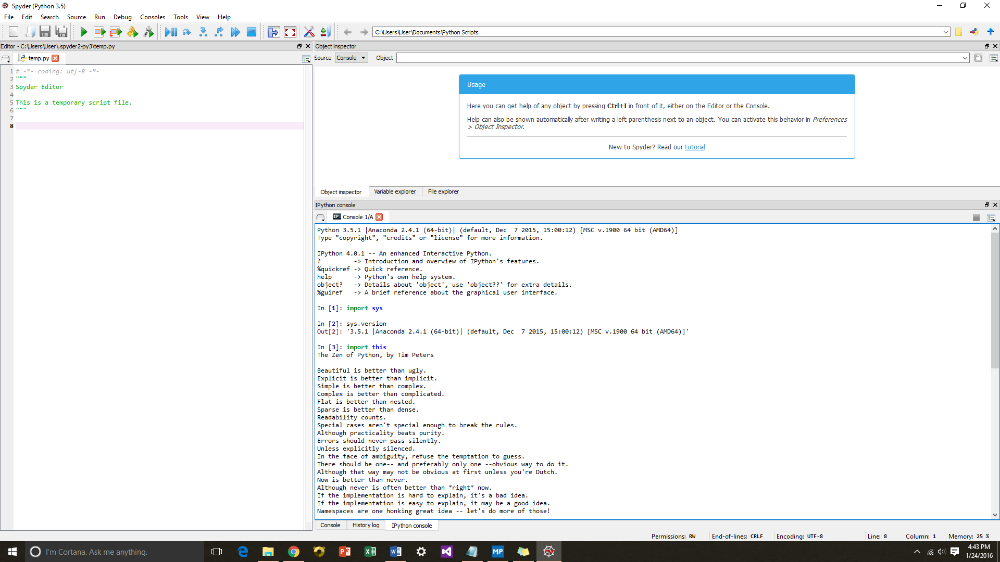

UECM3033 Assignment #1 Report
========================================================

- Prepared by: Penny Chong
- Tutorial Group: T2

--------------------------------------------------------

## Task 1 -- setup a github repository

The reports, codes and supporting documents are uploaded to Github at: 

[https://github.com/PennyChong/UECM3033_assign1](https://github.com/PennyChong/UECM3033_assign1)

---------------------------------------------------------

## Task 2 -- setup python

Put here the screen shot of file (python.png)

------------------------------------------------------------

## Task 3 -- modify and run Python script

In this section, please report:

1. The hexadecimal value of your student ID.

	The hexadecimal value of my student ID 1201782 is 125676.

2. Write down the definite integrals that you have chosen.

	$$\int_0^{1} \frac{x^2+7x}{(1 + \sqrt{x})^4}dx = \frac{-139}{6} + 34ln(2).$$

3. Write down your system of 10 linear equations.

\begin{align*}
2x_0 + 6x_1+ 20x_2 +45x_3 -5x_4 -3x_5 -8x_6 -45x_7 + 7x_8 +3x_9 &= 301,\\
8x_0 + 23x_1- 7x_2 - 32x_3+ 9x_4 +20x_5+ 11x_6 +2x_7 + 9x_8 +8x_9 &= 320,\\
3x_0 + 3x_1+ 2x_3 +57x_4 + 22x_5+ 4x_6 +x_7 + 6x_8 - 4x_9 &= 353,\\
2x_0 + x_1+ 9x_2 +4x_3 -3x_4 + 5x_5 -32x_6 -3x_7-15x_8 +8x_9 &= 304,\\
7x_0 + 3x_1+ 8x_2 +21x_3 + 9x_4 + 4x_5 + 2x_6 -4x_7 - 8x_8 +10x_9 &= 123,\\
2x_0 + 16x_1+ x_2 +x_3 +4x_4+ 2x_5 + 8x_7 - 4x_8 +2x_9 &= -30,\\
8x_0 + 9x_1+ 10x_2 +11x_3 + 23x_4 +4x_5 + x_6 -4x_7 - 66x_8 -3x_9 &= 855,\\
-6x_0 + 3x_1- 3x_2 +2x_3 + 8x_4 -6x_5 -28x_6 + 11x_7 + 22x_8 +7x_9 &= -247,\\
-3x_0 - 5x_1+ 3x_2 + 6x_3 + 4x_4 + 9x_5 + 6x_6 + 23x_7 + 3x_8 - 4x_9 &= -489,\\
12x_0 - 13x_1+ 2x_3 -2x_4 + 8x_5 -34x_6 + 7x_7 + 8x_8 +3x_9 &= -153. \\\\
x_0=-4,\;\; x_1=2,\;\;x_2=-8,\;\;x_3=-6,\;\;x_4=7,\\
x_5=5,\;\;x_6=-3,\;\;x_7=-18,\;\;x_8=-12,\;\;x_9=9.
\end{align*}

-----------------------------------

last modified: 26/01/2016 